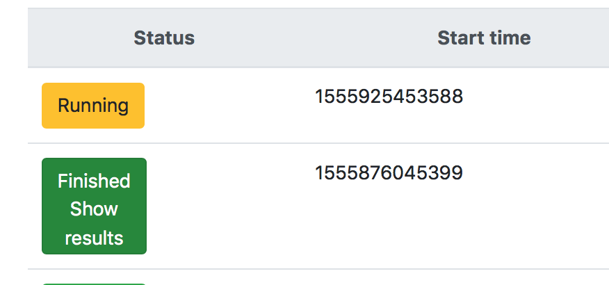
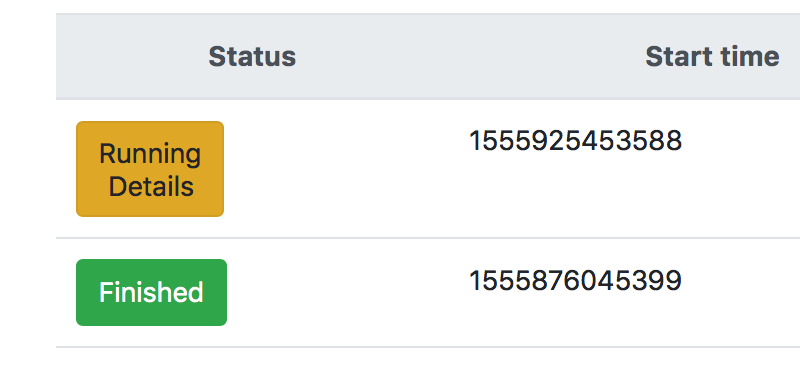

# Mongoose Web UI 
Provides web interface for Mongoose - storage performance testing tool maintained by Dell EMC. 

# 1. Overview 

Web UI lets you configure, run and monitor Mongoose. 

## 1.1 Launching

Mongoose launching process is devided in 3 steps: 
* nodes selection; 
* configuration set up; 
* scenario set up; 

### 1.1.1 Nodes selection 

Mongoose could be launched on multiple nodes. You could add and select nodes on the first step of set up. Added nodes will be remained within the UI. 

## 1.2 Configuring 

Configuration is being fetched via Mongoose REST API. You could change it via the UI. 
The changed configuration would be passed to Mongoose /run POST request as a parameter. 

## 1.3 Scenario 
Mongoose's scenarios are writtign in JavaScript. It's possibl to write JavaScript code in the UI using code editor. 

Scenarios could be both loaded and saved into the file system. 

## 1.2 Monitoring runs 

### 1.2.1 Runs table 
Discovered Mongoose's runs are displayed within the runs table. 
{:height="50%" width="50%"}

There's 3 possible status of Mongoose runs: 
* Finished - means Mongoose run has finished and its logs are available; 
* Running - means Mongoose is still performing the benchmark and results are not yet available. Althought, some of the details are available; 
* Unavailable - means info about Mongoose run has been found on the server, but the related data is lost or couldn't be loaded. 

You could see Mongoose run status or run details by pressing the status icon. 

{:height="50%" width="50%"}
{:height="50%" width="50%"}

# 2. Configuration 

# 3. Build and run 

# 4. Deploying 

## Mock Up

Views:
1. [Start](http://framebox.org/AhASg-vSSdFJ)
2. [Node Selection](http://framebox.org/AhAtx-jAZPRL)
3. [Defaults](http://framebox.org/AhATg-tbsaYz)
4. [Scenario](http://framebox.org/AhAvq-mJfTrb)
5. [Logs](http://framebox.org/AhAVi-MafEVE)
6. [Charts](http://framebox.org/AhAwq-XveMZm)

## Screenshots

### Runs page

### Nodes page

### Editing scenarios page

### Editing configurations page

### Downloading SVG page

### Weighted triangles algorithm in Grafana

## Build
` ./gradlew clean buildImage`

## Deployment with Docker

#### Build & Push docker image
As the server on which webapp rises, nginx is used.

To build image

` ./gradlew buildImage`

Before pushing image, please, login to your docker account

` docker login`

To push image to Docker hub

` ./gradlew pushImage`

## Clear production files 

` ./gradlew clean`

#### Run with docker Compose

To launch the GUI, you will need to pre-install the [Docker Compose](https://docs.docker.com/compose/install/). To start the server using docker-compose:

` docker-compose up`

*For the GUI to work, it is necessary to start Grafana and Prometheus services. The previous command pools the latest versions of the images from DockerHub and runs 3 separate containers.*

Then check using the browser that the GUI is available at http://localhost:8080

## To run in development mode, navigate to 'console' folder and use:
`ng serve` 

## Configuring container images parameters

Versions and hosts are stored within the environment variables. You're able to change them via .env file inside the root directory. 
If you rename some of them, make sure you rename it in other files: build.gradle
