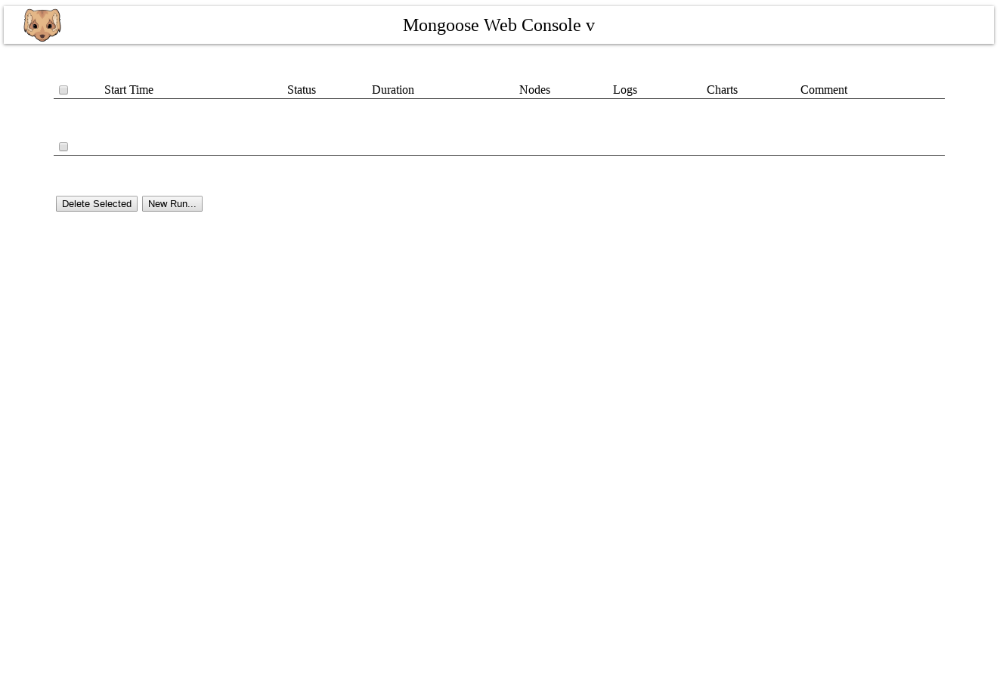
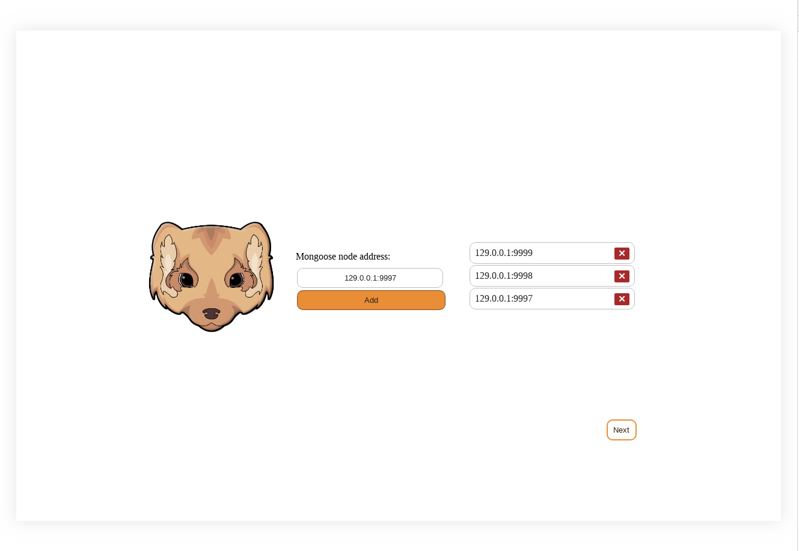
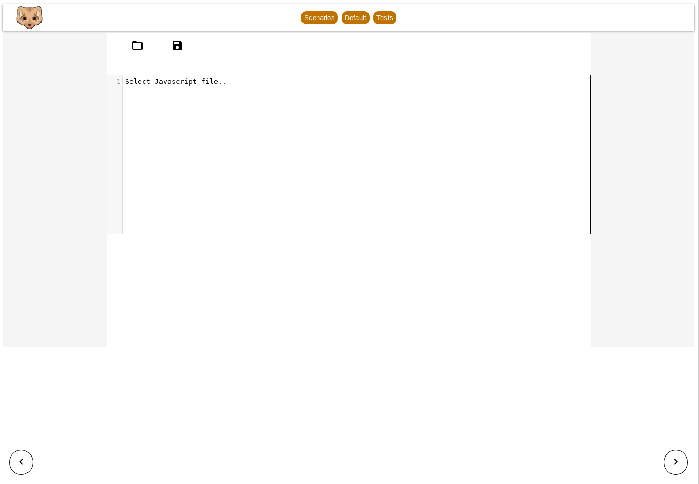
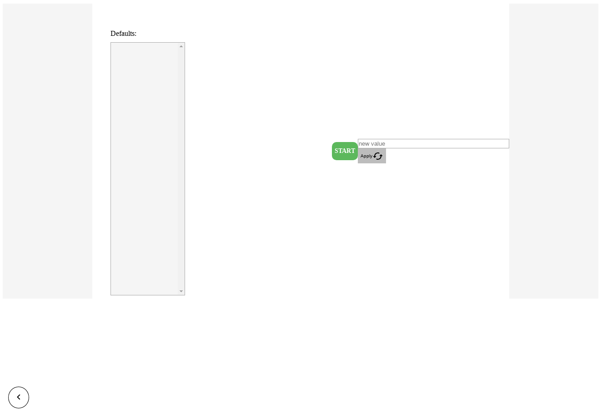
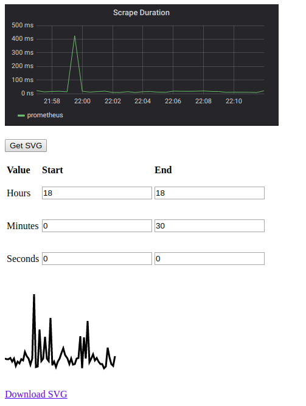
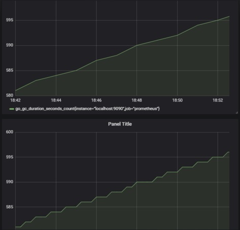

# Mongoose Console

## Mock Up

Views:
1. [Start](http://framebox.org/AhASg-vSSdFJ)
2. [Node Selection](http://framebox.org/AhAtx-jAZPRL)
3. [Defaults](http://framebox.org/AhATg-tbsaYz)
4. [Scenario](http://framebox.org/AhAvq-mJfTrb)
5. [Logs](http://framebox.org/AhAVi-MafEVE)
6. [Charts](http://framebox.org/AhAwq-XveMZm)

## Screenshots

### Runs page

### Nodes page

### Editing scenarios page

### Editing configurations page

### Downloading SVG page

### Weighted triangles algorithm in Grafana

## Build
` ./gradlew clean dist`

## Deployment with Docker

#### Build & Push docker image
As the server on which webapp rises, nginx is used.

To build image

` ./gradlew buildImage`

Before pushing image, please, login to your docker account

` docker login`

To push image to Docker hub

` ./gradlew pushImage`

## Clear production files 

` ./gradlew clean`

#### Run with docker Compose

To launch the GUI, you will need to pre-install the [Docker Compose](https://docs.docker.com/compose/install/). To start the server using docker-compose:

` docker-compose up`

*For the GUI to work, it is necessary to start Grafana and Prometheus services. The previous command pools the latest versions of the images from DockerHub and runs 3 separate containers.*

Then check using the browser that the GUI is available at http://localhost:8080

## To run in development mode, use:
`ng serve` 

## Configuring container images parameters

Versions and hosts are stored within the environment variables. You're able to change them via .env file inside the root directory. 
If you rename some of them, make sure you rename it in other files: build.gradle, nginx.conf.template 
